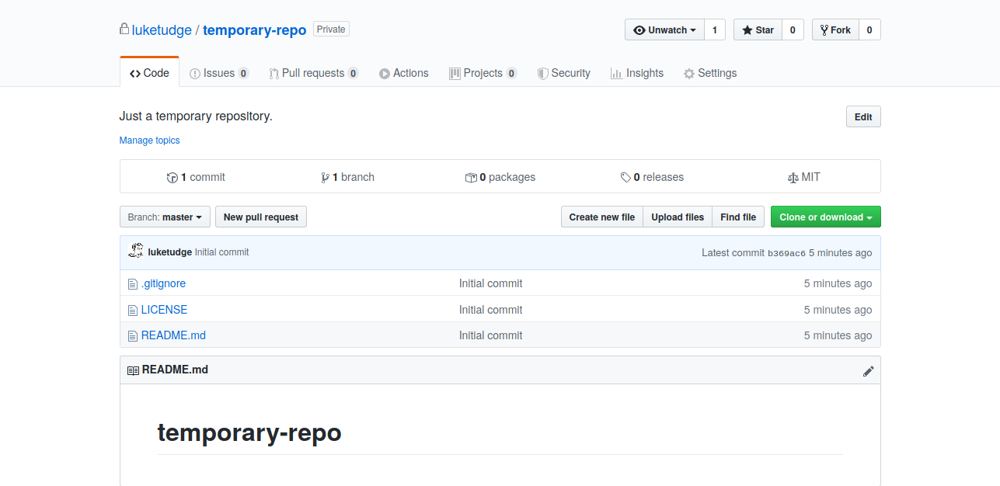
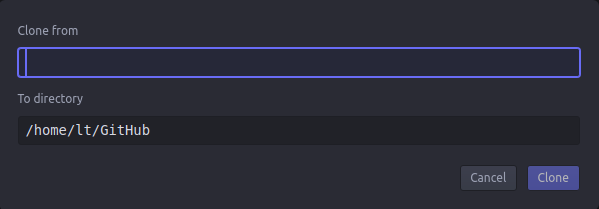
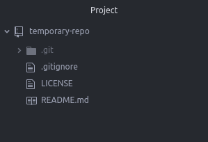
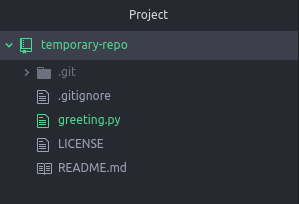
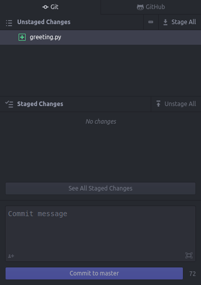
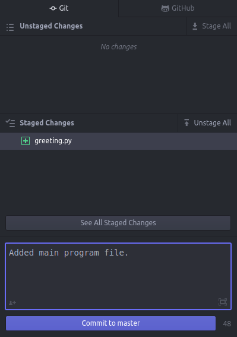
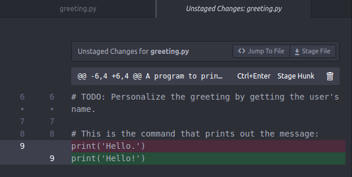

<h1>Contents<span class="tocSkip"></span></h1>
<div class="toc"><ul class="toc-item"><li><span><a href="#Version-control" data-toc-modified-id="Version-control-1">Version control</a></span><ul class="toc-item"><li><span><a href="#git" data-toc-modified-id="git-1.1">git</a></span><ul class="toc-item"><li><span><a href="#Configuration" data-toc-modified-id="Configuration-1.1.1">Configuration</a></span></li></ul></li></ul></li><li><span><a href="#Creating-a-repository" data-toc-modified-id="Creating-a-repository-2">Creating a repository</a></span><ul class="toc-item"><li><span><a href="#README" data-toc-modified-id="README-2.1">README</a></span><ul class="toc-item"><li><span><a href="#Markdown" data-toc-modified-id="Markdown-2.1.1">Markdown</a></span><ul class="toc-item"><li><span><a href="#Headings" data-toc-modified-id="Headings-2.1.1.1">Headings</a></span></li><li><span><a href="#Links" data-toc-modified-id="Links-2.1.1.2">Links</a></span></li></ul></li></ul></li><li><span><a href="#gitignore" data-toc-modified-id="gitignore-2.2">gitignore</a></span></li></ul></li><li><span><a href="#Working-locally" data-toc-modified-id="Working-locally-3">Working locally</a></span><ul class="toc-item"><li><span><a href="#Atom" data-toc-modified-id="Atom-3.1">Atom</a></span><ul class="toc-item"><li><span><a href="#Cloning" data-toc-modified-id="Cloning-3.1.1">Cloning</a></span></li><li><span><a href="#Making-changes" data-toc-modified-id="Making-changes-3.1.2">Making changes</a></span></li><li><span><a href="#commits" data-toc-modified-id="commits-3.1.3">commits</a></span></li><li><span><a href="#diffs" data-toc-modified-id="diffs-3.1.4">diffs</a></span></li><li><span><a href="#push" data-toc-modified-id="push-3.1.5">push</a></span></li></ul></li></ul></li></ul></div>

# GitHub

When we start to write 'real' programs that other people will actually want to use, we will need to clean up our act a bit and adopt a more organized way of working. In particular, if we have to collaborate with other programmers, there are some important things that we will need to organize to avoid getting into a sticky mess:

* **A [repository](extras/glossary.md#repository)**. We would like a single central location where the current version of our program is stored and available to others, instead of just storing our program on our own computer and emailing it to people then emailing them again when we correct a mistake and then emailing them a third time when we forget the attachment.
* **[Version control](extras/glossary.md#versioning)**. We would also like to keep track of different versions of our program. We may need to work on some changes provisionally, until we are confident that they are correct, or we may need to undo some changes once we discover that they have completely broken everything.
* **Documentation**. We should organize and make available some documents that explain to others how to use our program or how it works. Ideally these should be a little bit prettier than just plain text [docstrings](extras/glossary.md#docstring).
* **Communication**. We would like to provide our users and collaborators with a channel through which they can notify us of all the embarrassing mistakes that they have discovered in the program, or request unnecessarily complex new features that they would urgently like the program to have.
* **Collaboration**. We may eventually be lucky enough to have assistants or kind mentors helping us write the program. We should let them know clearly what their tasks are (and are not), and provide a place for them to record their changes.

[GitHub](https://github.com/about) is a web platform that makes all of these things possible. We can store our computer programs on the GitHub website, track successive versions as we make changes, add attractive documentation, get notifications from others who comment on our project, and so on. GitHub isn't the only platform that provides these services, but it is one of the most widely used, and is relatively easy to navigate. In this lesson we will learn the basics of using GitHub to manage programming projects.

## Version control

'Version control', or simply 'versioning', broadly refers to the practice of tracking multiple versions of something. That something needn't especially be a computer program. You have probably practiced version control at some point in your career, for example with an essay or thesis that you wrote at college when you created a series of documents called *thesis_v2.docx*, *thesis_v3.docx*, *thesis_final.docx*, *thesis_final_adviser_corrections.docx*, *thesis_really_final.docx*, and so on.

Version control is particularly important for computer programs. In part this is because they often span more than a single file (for example a main [script](extras/glossary.md#script) along with one or more [modules](extras/glossary.md#module)), and in part because they are fragile; small mistakes can break them entirely, and changes to one part of the program need to be carefully tested to make sure that they are compatible with existing parts.

For these reasons, version control for computer programs is often automated; a version control program monitors our changes continuously in the background, records them, and later allows us to review, undo, or redo them in various combinations. An automated version control program is essential to any moderately large programming project. Imagine the hassle and the mistakes you could make if you had to manually name and store all the separate versions of all the files in your computer program in the same way as for a college thesis.

### git

There are various automatic version control programs available, but by far the most widely used is called *git*. git is a program that monitors changes to groups of files, and records those changes.

git and GitHub are two separate things, but they work together. git is a program on our computer that does the job of recording our changes locally and offline, whereas GitHub is a website on which to store the records that a git program makes. In a very loose analogy, you can think of git as being like the 'track changes' feature of a word processor program, and GitHub as being the equivalent of Dropbox or GoogleDrive, where you can store and view documents and review changes to those documents.

So to follow along with the examples in this lesson, you will need both an online account at the GitHub site (it's free and you can sign up [here](https://github.com/join)) and you will need to have git installed on your computer.

(And in case you are wondering why git is called the way it is, there are a few speculations [on Wikipedia](https://en.wikipedia.org/wiki/Git#Naming).)

#### Configuration

First check whether git is installed on your computer. To check, try `git` as a command line command at the Spyder console (don't forget the `!`). For example, you can ask git what version it is:


```
! git --version
```

    git version 2.17.1


If you see a response like the one above (don't worry if you get a slightly different version number), then git is installed. If instead the response is something like 'not found' or 'not recognized', then you will need to install git if you want to follow along with all of the examples in this lesson. Take a look back at the [instructions for installing software for the class](extras/software/install.md#git).

In order to synchronize programming projects on your own computer with your online storage at the GitHub website, git needs to know who you are on GitHub. To achieve this, you can configure git so that it knows your GitHub username and email. The command `git config`, together with the `--global` option, sets the global configuration for git on your computer ('global' in the sense that it applies across all of the git projects that you work on, and is not special to just one project).

Use it to set the `user.name` and `user.email` options. Like this:


```python
! git config --global user.name 'luketudge'
! git config --global user.email 'luketudge@gmail.com'
```

Make sure that the username and email that you enter are the same ones you used when you signed up for a GitHub account.

You can check that these commands have taken effect correctly using the `--list` option for `git config` to list your full global configuration:


```
! git config --global --list
```

    user.name=luketudge
    user.email=luketudge@gmail.com


A few more details about configuring git are given at the [git website](https://git-scm.com/book/en/Getting-Started-First-Time-Git-Setup), but the configuration steps shown above are the only ones you are likely to ever need for basic use.

## Creating a repository

Let's now see how to create a new repository in which to store a programming project and track its versions with git. You can create a repository using git on your computer and then upload it to the GitHub website, or you can first create the repository directly on the GitHub website and then clone it to your computer. The second of these options is considerably simpler, so we will learn only about this one.

To follow along, you now need to head to the [GitHub website](https://github.com) and log in. Then look for the button for creating a new repository:


GitHub will then walk you through some options for your repository:

* **Repository name**.
* **Description**.
* **Public or private**. A public repository is visible to anyone. Usually you will eventually want to make your repository public, so that people can download and test out your program, or so that you can include a link to your work in a job application. But you might want to make it private to begin with, until you are happy with it. You can always make a private repository public later.
* **Initialize this repository with a README**. A [readme](extras/glossary.md#readme) is a file that provides information about a program. You should always include one. We will see in a moment what to write in the README file.
* **Add .gitignore**. We will learn about this in a moment. For a repository that contains a Python programming project, you should select the *Python* option from the dropdown menu here.
* **Add a license**. For a real project that you intend to make public you should always include a license file. This file provides the legal framework for your project and lets people know what they can and can't do with it. [choosealicense.com](https://choosealicense.com) provides some help with choosing a license. For most projects you can choose the 'MIT License', a standard 'permissive' license that allows people to do what they like with your program.

To test out the examples below, just create yourself a new private repository with some wacky name. You can delete it later when you have finished testing things out. Tick the option to include a README, and add a Python .gitignore file and the MIT License file.

Once you have created your repository you will see its main GitHub page, which looks a bit like this:



On the front page of your repository, GitHub displays a table of the files that it contains. You can see that the three files we requested when setting up the repository are in there. Let's look at two of these in more detail.

### README

The file *README.md* not only appears not only in the table of files, its contents are also displayed immediately beneath. This is a feature of the GitHub site. If you put a file with the name *README* in your repository, its contents will be shown on the main page. So you can use this file to act as the front page of your repository, explaining the nature of your project, and providing links to the most important files.

At the moment, your *README* file contains only the name of your repository. Let's edit it to see what else we can put in there. You can edit a file directly on the GitHub website via the edit button:


#### Markdown

You may have wondered what type of file the *md* file extension refers to. 'md' here stands for 'markdown'. Markdown is a programming language (of sorts), but an extremely limited one. It consists mainly of normal human-readable text, with just a few extra symbols that instruct a web browser (or some other text display program) to add 'special effects' to the text. A language of this kind, that adds extra symbols to plain text in order to organize how it is displayed, is known as a [markup language](extras/glossary.md#markup).

Markdown can add many features to your README file. The [GitHub guide to markdown](https://guides.github.com/features/mastering-markdown) gives a good overview. The two most useful ones are:

##### Headings

One or more hash symbols `#` at the beginning of a line turn that line into a heading (note that this is completely different from the role of the hash symbol in Python). The more hash symbols, the smaller the heading.

For example:

`# Main heading`

`## Sub-heading`

`### And so on`

##### Links

To turn some text into a clickable link, enclose the text in square parentheses `[]`, then immediately afterwards enclose the address that you would like to link to in round parentheses `()`.

The address can be the address of a web page, for example:

`Learn about the candiru fish [here](https://en.wikipedia.org/wiki/Candiru).`

Or it can be the [relative path](extras/glossary.md#path) to a file in your repository. For example:

`The most important Python module in this project is [important.py](python_files/modules/important.py).`

Try editing your README file to include some headings and a link to the license file. You can check whether you have got the markdown right by clicking 'Preview changes'. To save your changes, click on the 'commit' button at the bottom of the editing page:


Ignore the other text fields and options above the commit button for the moment. We will learn about these later.

Then the README display on the front page of your repository should look something like this, depending on what headings and text you put in:


### gitignore

In a moment you will copy your new repository to your computer, where you can start adding new files, making changes, and so on. Each time you make changes you can send your files back to the GitHub website to store them there. But you might not always want to upload all of the files that are in your the folder on your computer.

In particular, there are certain temporary files that get created automatically when you run Python programs. You might already have noticed these appearing in your working folder after you have been doing some Python work. For example, Python creates a directory called *\_\_pycache\_\_* to store the results of [modules](extras/glossary.md#module) that have already been [imported](extras/glossary.md#import) so that it does not have to run them again if you import them a second time. The contents of \_\_pycache\_\_ directories and other temporary files are not really part of a programming project, so you don't want to accidentally publish them to your GitHub repository when they get created on your computer.

A 'gitignore' file instructs git to ignore certain files and not include them as part of the project. git won't track changes to these files, and it also won't upload them from your computer to the GitHub website when you publish your changes. Take a look at the contents of the gitignore file in your repository (you can just click on the file name in the files table). It contains the names of files and directories that git should ignore. You will see that '\_\_pycache\_\_/' is one of the first things that appears in the file.

GitHub provides this ready-made gitignore file full of the names of temporary files that might get created in the course of developing a Python program. It is this gitignore file that we chose when we created the repository. (Other programming languages create other temporary files, and GitHub provides ready-made gitignore files for these too.) Later on, if you create additional files on your computer that you do not want to send to GitHub, for example a file of private notes, confidential data files, or a record of grievances against your coworkers, you can add the names of these files to your gitignore file to stop them being sent to GitHub.

If you are interested in the legal issues involved in developing software, you can take a look at the contents of the 'LICENSE' file too. But for now we are finished with exploring the new repository on GitHub. We will turn next to copying the repository onto your computer and working with it there.

## Working locally

### Atom

It is entirely possible to work with git using only command line commands, and many people work this way. However, we won't torture ourselves unnecessarily. From here on, we will use a graphical interface to git instead. The command line may come in useful later in your career, for example if you have to write a program to automate some git tasks, or if you have to work on a web server computer that has no screen. But for now, don't be a masochist just for the sake of feeling like a 'real' programmer.

The Atom text editor is a text editor produced by the developers of GitHub. As well as editing text files, Atom works with git to let you manage your project by clicking on buttons instead of typing commands. If you have not already installed Atom, you can download it [here](https://flight-manual.atom.io/getting-started/sections/installing-atom). Then go and find it among your apps.

Most of what you see when you start up Atom will look familiar. Like any other editing program (and like the Spyder editor), it has a 'File' menu, from which you can open existing files or create new ones.

#### Cloning

Copying an existing repository onto your computer is known as 'cloning' the repository. Let's see how it is done. Go to the main page of your new repository and look for the button marked 'Clone or download'. It looks like this:


You can use this button to just download all the files in a repository as a *zip* archive. But don't do this. If you just do this, you will get the files, but git won't recognize them as a project to track. Instead, copy the URL that is shown inside a text box when you click on the button. It will look something like this (assuming your GitHub username is 'mildred'):

`https://github.com/mildred/temporary-repo.git`

Now go to the Atom window and from the main menu bar choose **Packages** > **Command Palette** > **Toggle**. This will bring up a searchable list of all the things that you can do with Atom. Search in there for 'github clone' and you should get one result. Click on it and you will see a dialog like this:



Enter the URL that you just copied from your repository into the 'Clone from' field. In the 'To directory' enter the [path](extras/glossary.md#path) to the directory that you would like to store your repository in. When you click 'Clone', Atom will download the repository to that directory, and then open the repository so that you can view its contents.

You should now see a few panels displayed side-by-side. At the left is a panel showing the files contained in the repository:



#### Making changes

Leave Atom for a moment and find the newly-cloned repository folder in your file explorer. It works entirely like a normal folder. You can copy or save files into it, create new subdirectories, delete files, etc. If you would like to remove the repository, you can just delete the folder like you would any other. git will then forget it.

You should see in the repository folder the same three text files that you just saw on the GitHub website ('README', 'LICENSE', and '.gitignore'). If you don't see '.gitignore', this is probably because it has a name beginning with a dot, which on most file systems indicates a file that is intended to be 'hidden' (i.e. not shown by default). If you would like to be able to see hidden files in general in your file explorer, then you can configure it to do so. Follow the instructions for your operating system:

* [Windows](https://support.microsoft.com/en-us/help/14201/windows-show-hidden-files)
* [macOS](http://osxdaily.com/2018/02/12/show-hidden-files-mac-keyboard-shortcut/)

Let's now make a change to your local copy of the repository. You make changes in all the normal ways; there is nothing special about working with a git repository folder. For example, you can use your normal file explorer to copy and paste files from other locations into your repository folder. To try this out, just copy in one of your Python program files. You can use one of the solutions you wrote to the exercises in earlier lessons.

#### commits

You have just made a change to the repository by adding this file. Let's now see how to review the change and send it back to the online repository on GitHub.

Go back to Atom and take a look at the files list on the left. Atom color-codes files according to what has happened to them since you last saved the state of the project:

* **green**: new file
* **orangey-brown**: file has been changed

git has been tracking changes to your project, and it should have noticed that you have added a new file since you cloned the repository. So you should see the new file highlighted in green, like this:



Atom has separate panels for interaction with git and GitHub. These might not be displayed by default but you can call them up by clicking the 'git' and 'GitHub' buttons at the bottom right of the Atom window:


You should then see that your new file is displayed in the git panel:



When git tracks changes to our project, it distinguishes between temporary and confirmed changes. All the changes that we make as part of our normal work will initially be treated as temporary changes, and can be easily undone if we wish. Atom allows us to undo changes to one or more files from the git panel. Just right click on any file that is listed under **Unstaged changes** and choose **Discard Changes**. This is a simple way of resetting your project to its previous state if you decide that you don't want to keep your current work. But don't do this just now for your new file, or you will have to copy it back into the repository folder again.

Instead, let's confirm the addition of this new file as part of the project. In the terminology of version control, confirming that we would like to keep some changes is known as '[committing](extras/glossary.md#commit)' the changes. When we commit changes, git puts them into the version history of our project, so we have a record of the state of the project before the commit, and after. In the Atom git panel, you can click on the button marked **Stage all** to prepare all the current changes to be committed. If you have made changes to multiple files and you would like to commit only some of them, then you can instead right click on the files for which you wish to commit changes, and select **Stage**. So far we anyway only have one changed file, so you can do either of these two things.

The new file to be committed should now appear in the **Staged chnages** area. The last step is to add a message to this 'commit'. We should use this message to describe what changes we made. Later on, this message helps us and others to see easily what it was that differed in each new version of the project. Type in a message as shown below, and then click on the **Commit to master** button at the bottom.



That's it; now the new file has become part of the version history of the project. At the very bottom of the git panel you will see a list of all the recent [commits](extras/glossary.md#commit). This is our record of the successive versions of the project:


#### diffs

Let's see one other variation on making changes. This time, let's change an existing file rather than adding a new one. Open up the new Python file that you just added to the project, and make some spurious change like adding a comment or changing some printed text. Atom is a text editor, so you can make the change directly in Atom if you like. Just click on the name of the file in the files panel on the far left to open it up. Or you can edit the file in Spyder or in another text editor; it doesn't matter. After you have saved your change, you should see that Atom highlights the name of the file in orangey-brown, which is the color code for 'changed file'.

When files change rather than being created, git allows us to review the differences between the old file and the new one. The various changes that have been made to one or more files since the last [commit](extras/glossary.md#commit) are known as the 'diff' (a somewhat excessive abbreviation of the word 'difference'). It is a good idea to always look at the diff before committing changes. In a complex project, it is very easy to introduce unwanted changes by mistake, and looking only at the differences rather than the whole file can make it clearer whether we have made a mistake.

In the Atom git panel, click on the name of the changed file in the **Unstaged Changes** area. This will display the changes to the file, showing old lines in red in new lines in green, like this:



(A common confusion at this point is to mix up the files panel on the left and the git panel on the right. If you click on files in the files panel, they will open up for editing in the normal way. If you click on files in the git panel, you will see changes to those files, you won't open them for editing.)

When you have reviewed your changes, you can stage them, add a commit message, and then commit, as we did above.

In general, the pattern when working on a programming project under version control is usually:

* **Make changes**.
* **Test**. Don't forget about [testing](testing.md).
* **Review**. Look at the diff for your changes to check they are as you wanted.
* **Commit**. Commit the changes so you have a new working version of your project.

Try to work only on one aspect of the project at a time, so that all the changes you make in one commit are related to fixing just one problem or adding one new feature. Also try to make sure that each commit still produces a working version of your program so far, if possible. This ensures that each version of your project differs in only one respect from the previous version, and still works.

#### push

Up until this point, all of the changes that we have committed have been committed only to the version history of the project that git stores on your computer. Nothing has yet been sent back to GitHub. Once you are done with the working day and have made several commits, the final step is to send all your commits back to GitHub so that your online repository is up to date.

Sending changes to another repository is called '[pushing](extras/glossary.md#push)' those changes. At the bottom of the git panel you will see a button marked **Push**, together with the number of commits that you have made:


Click on this button to send your commits to the GitHub repository. Once this is done, you should be able to go back to your GitHub repository and see the new file there. You may need to refresh the webpage first.

GitHub also provides a means to review the changes that were made in each commit. Look for this button on the main page of your repository:


Click on this and you will find a page that lists all the commits so far. You should see there the commit messages that you entered. Click on any one of these and you will see a [diff](extras/glossary.md#diff) display a bit like the one you saw in Atom, allowing you to check what was changed in each new version of the project.
