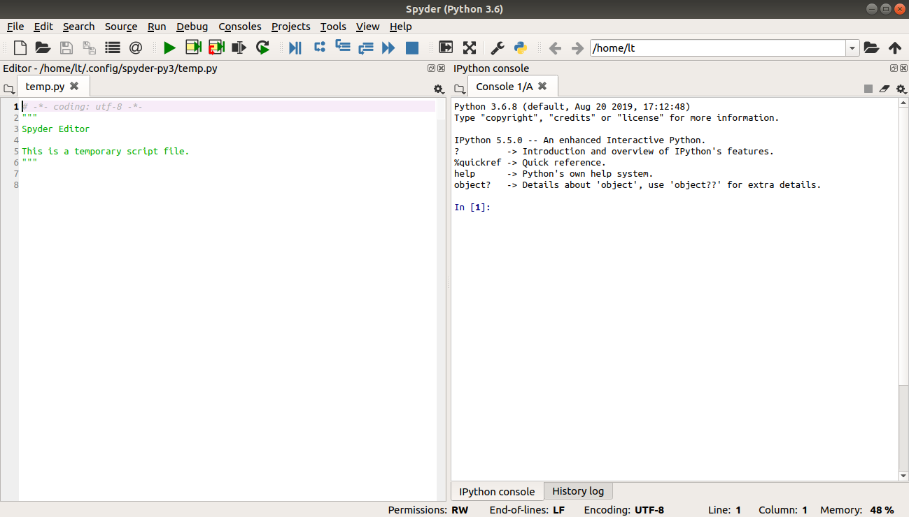
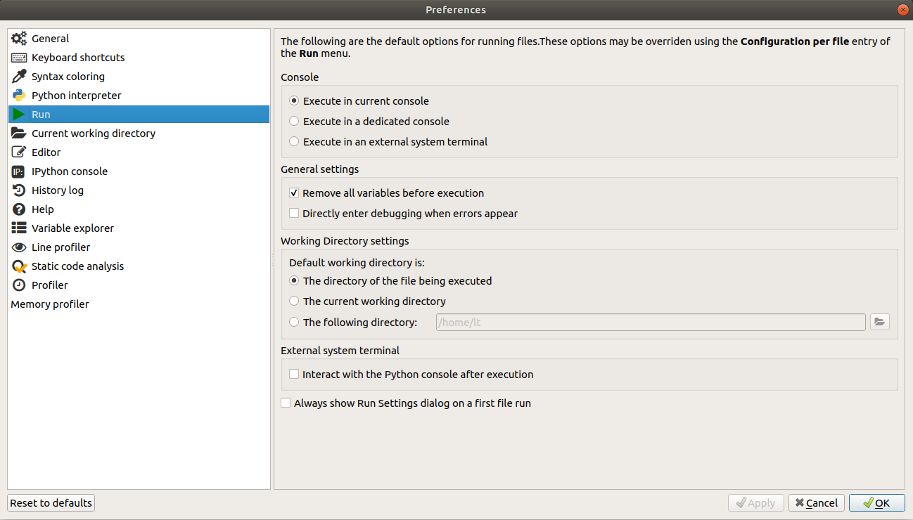
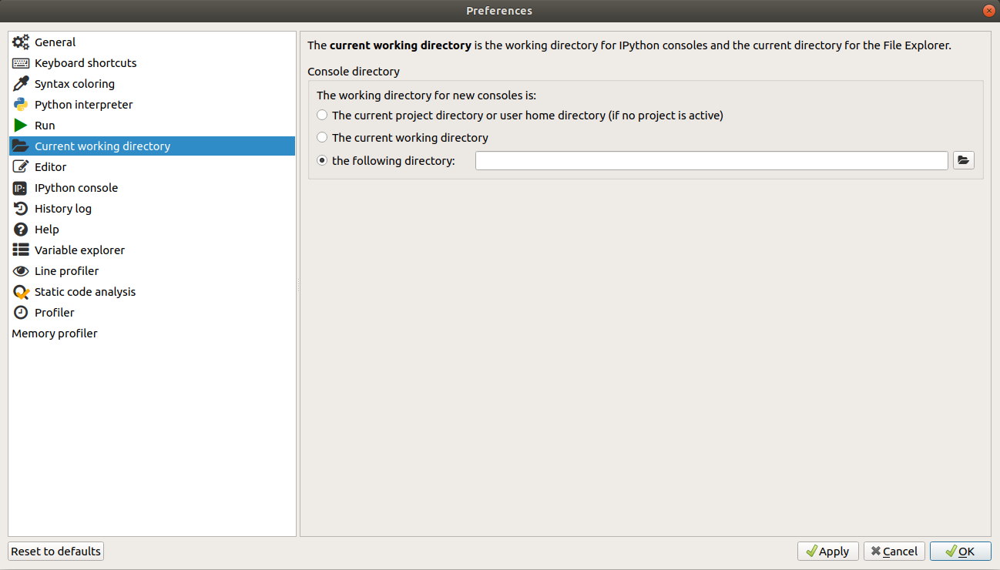

# Spyder configuration

In order to avoid some common difficulties, you should change two important options within Spyder. Start up Spyder. Go to the **Tools** menu and select **Preferences**. You should change a few of the preferences.

Under the section **Run**, make sure that the option **Remove all variables before execution** is selected, and that the section **Default working directory is:** is set to **The directory of the file being executed**. Click **Apply** to make these options take effect. Together, these options ensure that each Python program that we run will start from a clean slate in its own directory and will not be affected by the actions carried out by a previous program or by files contained in some other directory. This is important because we want our programs to work for anyone, and not be dependent on other actions that we have taken before running the program or on the contents of our home folder.

Second, outside of Spyder create for yourself a new directory somewhere on your computer. This is the directory where you will save all your notes for the class, and where you will save any extra files that we work with during the class demonstrations. Now return to the **Preferences** window in Spyder and under the section **Current working directory** select **the following directory** and click the button on the right to navigate to the directory that you just created. Again, click **Apply** once you have done this. This sets the default directory that Spyder will look in when it launches. As long as you save the course materials in this folder, you will be able to find them easily from Spyder. If you now close and restart Spyder you should see that the path to the directory you chose now appears at the top right of the Spyder window.

